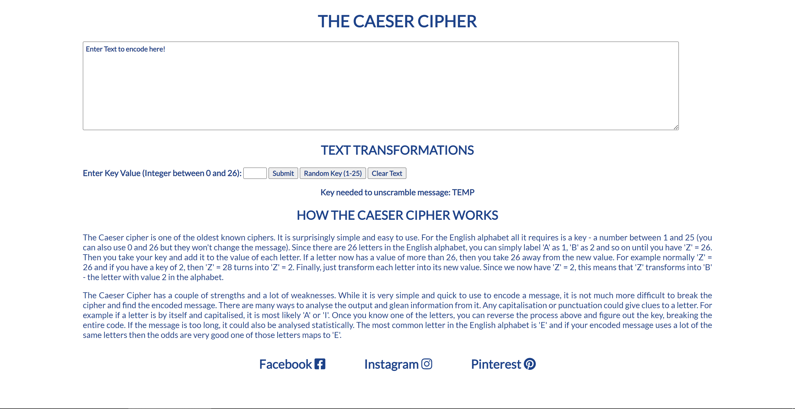
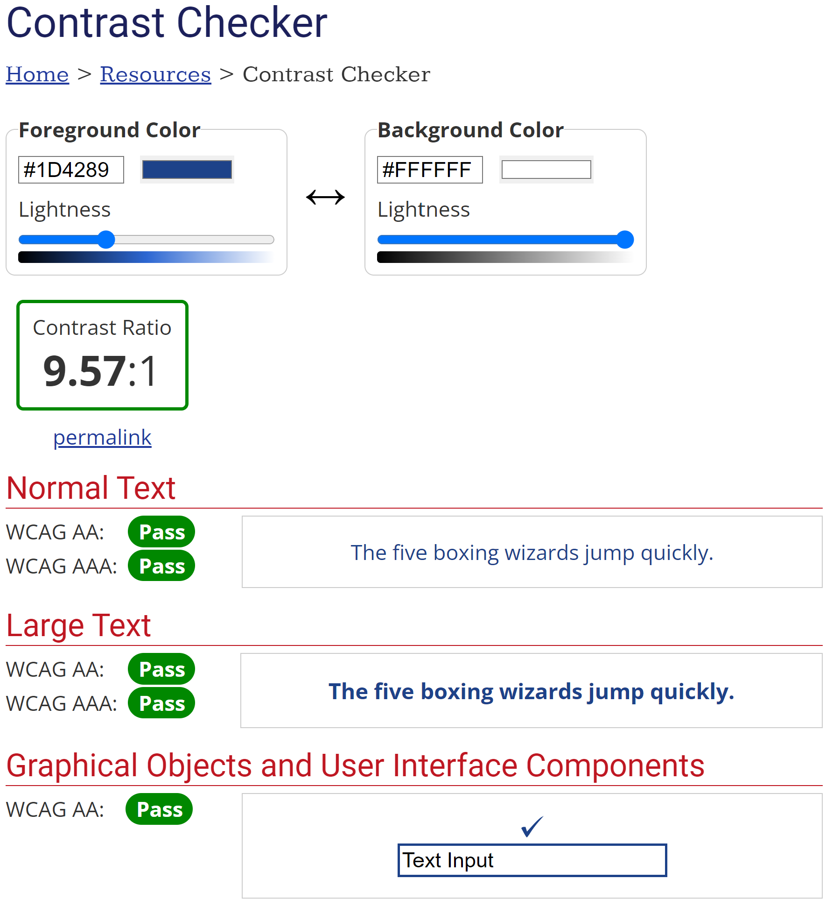
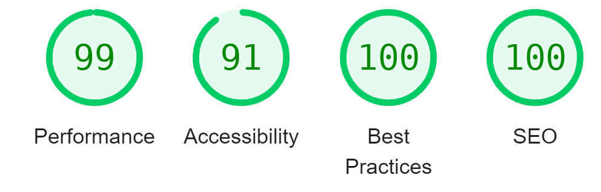
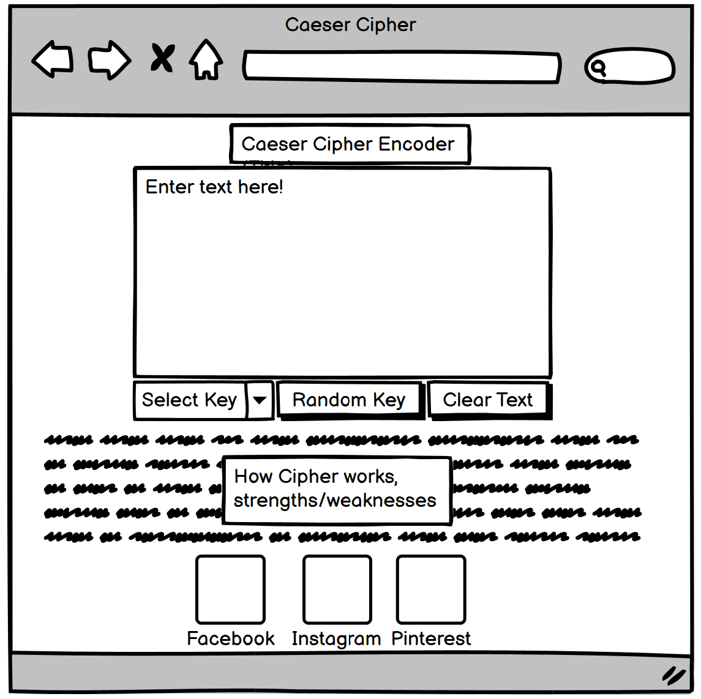
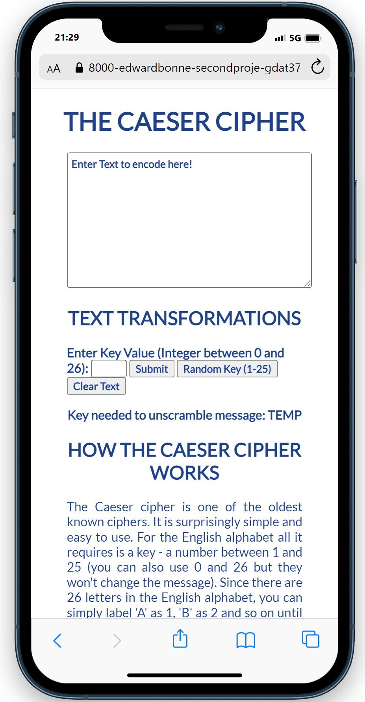

# Caeser Cipher

## Purpose of the Project
 - The Caeser Cipher website is a site that hopes to encourage a user's interest in encoding messages and cryptography with a simple caeser cipher, allowing users to create, encode and decode messages. The site will be useful to beginners interested in cryptography.   

## Existing Features and User Stories
 

### Title
 - A simple header to quickly show the user the name of the website and what it is about

### Text area
 - A large box for the user to enter the text they want to encode. 
 - Features a simple message instructing the user

### Text transformation section
 - Features an instruction for the user to enter a correct key input to encode their message
 - Next to this instruction is an input box for the user's key that only takes integers, if the user attempts to enter non-integers, integers outside of the valid range or an empty input they will recieve an alert telling them what to enter. Their message will remain unchanged. 
 - By this is the submit button, this will encode the user's message with their selected key after validation.
 - Next is the Random Key button. This will encode the user's message with a random key, with the transformations of 0 and 26 removed so that the message will always change.
 - The final Clear text button does exactly what it says, removing the old message for the user on click.
 - Finally below these inputs is a message to the user, instructing them on what key to use to decode their message, allowing them to see it again after it has been encoded.

### Explanation section
 - This section explains the workings of the cipher to the user, as well as the limitations of it.

### Footer section
 - The footer contains links to social media, which are valuable to the user because it allows them to share their encryptions and the website on social media.
 - The links open in a new tab for ease of use and to allow the user to return to the site easily.

## Future Features
 - In the future the site can be expanded to show an input and output window allowing the user to see their message before and after it is encoded.
 - A hero image, something to draw the users attention to the project and make the website more memorable.

## Typography and Color Scheme
 - The priority when choosing the typography and colour scheme was accessability, the site is highly accessible as shown by the following below.
 - The Lato font, with a sans-serif backup, were chosen for their high readability and accessability.
 - The contrasting colors #FFFFFF (background) and #1D4289 (font & borders) used on the website have a high contrast and easily pass the WCAG tests as per WebAIM: Contrast Checker
 
 - Finally the developer tool Lighthouse was used to test the website
  

## Wireframes
 - A wireframe of the project was planned using Balsamiq.
 
Having a rough plan of the website while building it was very useful in planning out the html and css parts of the website.

## Testing
 - As above, the website has passed many accessability and contrast tests.
 - Using the Chrome Mobile Simulator tool the site was tested on different screen sizes. It is quite responsive with no errors due to resizing.
 
 - The site has been tested using the Internet Edge and Firebox browsers and performs the same there as google chrome.
 - temp - html validator w3c
 - temp - css validator jigsaw
 - temp - js validator jshint

 ### Internal Link Testing
 - The text box is selectable and takes inputs correctly
 - The key value can be entered and has been tested with the correct results for all valid integer inputs.
 - For submitting invalid inputs, an error alert pops-up, informing and directing the user and the text inside is not transformed.
 - Negative integers, letters, special symbols and integers above 26 have been tested and all show the error message.
 - The random key generates numbers between 1 and 25 correctly and displays the correct text results. This has been tested externally by using a for loop to generate all the valid numbers to check the function and by checking the random number generation works using a brute force approach in a for loop.
 - The clear text button clears the text with no issues
 - The key needed to unscramble the message shows the correct value for all valid key inputs (0 - 26)

 ### Bug Testing
 - Bugs were primarily detected using Python Tutor (https://pythontutor.com/). It has a step-by-step process to narrow down the point where the code creates an error, such as an incorrect value.
 - Fixed Bug - caeser-input area width and margins added to 100%, making website slightly too wide since I did not account for all margins, padding and borders
 - Fixed Bug - mixing variables in caeser function
 - Fixed Bug - in html with submit id = "(caeserEncode)", now "caeserEncode()", this prevented js linking to html.
 - Fixed Bug - indexing error in js for (let i = 0; i <= inputLength; i++) {. This bug counts i one higher than needed, changed to i < inputLength> so that the function correctly iterates over the message length (and not one more than that).
 - Fixed Bug - transforming non-letter inputs into letters, creating undefined output in place of non-letter input. Added check to code to determine input type and avoid transforming non-letters.
 ### There are no known remaining bugs

## Deployment
### Gitpod
 - Gitpod contains all of the building blocks and commits of the site. 

### Github Pages
 - The finished site was deployed to Github pages, the steps to deploy are:
 - In the github repository, navigate to the settings tab
 - From the source menu select the master or root branch
 - Once selected the page will be refreshed and the site deployed
 - The live link can be found here: https://github.com/EdwardBonner96/second-project-submission

## Credits
### Content
 - The icons in the footer were taken from Font Awesome
 - The Lato Font is from Google fonts. 